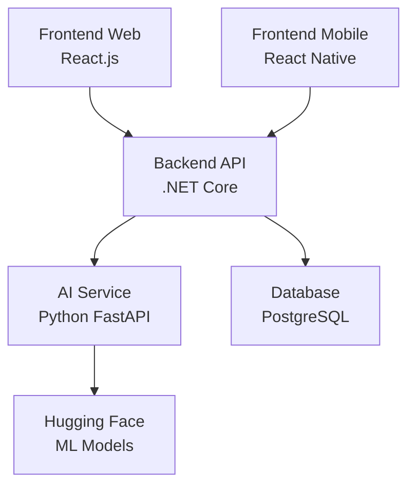

# 🚀 Emotion Chat

> A real-time chat application with AI-powered emotion analysis

[](https://github.com/yourusername/emotion-chat)
[](https://dotnet.microsoft.com/)
[](https://reactjs.org/)
[](https://fastapi.tiangolo.com/)
[](LICENSE)

## 🌟 Features

- **Real-time Chat**: Instant messaging with live sentiment analysis
- **AI-Powered**: Advanced emotion detection using machine learning
- **Multi-Platform**: Web and mobile applications
- **User Management**: Active user switching and session management
- **Responsive Design**: Beautiful UI that works on all devices
- **Production Ready**: Fully configured for deployment

## 🏗️ Architecture



## 🚀 Quick Start

### Prerequisites

- [.NET 8 SDK](https://dotnet.microsoft.com/download)
- [Node.js 18+](https://nodejs.org/)
- [Python 3.10+](https://python.org/)

### Local Development

```bash
# Clone the repository
git clone https://github.com/yourusername/emotion-chat.git
cd emotion-chat

# Setup all services
.\setup.ps1

# Start all services
.\start.ps1
```

### Access Points

- **Frontend**: http://localhost:3000
- **Backend API**: http://localhost:5000
- **AI Service**: http://localhost:8000
- **API Documentation**: http://localhost:5000/swagger

## 📱 Applications

### Web Application
- **Technology**: React.js with TypeScript
- **UI Framework**: TailwindCSS
- **State Management**: React Query
- **Features**: Real-time chat, user switching, responsive design

### Mobile Application
- **Technology**: React Native with TypeScript
- **Storage**: AsyncStorage for offline support
- **Features**: Native mobile experience, push notifications ready

## 🤖 AI Service

- **Framework**: FastAPI
- **ML Models**: Hugging Face Transformers
- **Analysis**: Real-time emotion detection
- **Languages**: Python 3.10+
- **Performance**: Optimized for instant analysis

## 🛠️ Development

### Backend Development
```bash
cd backend
dotnet run
```

### Frontend Web Development
```bash
cd frontend-web
npm start
```

### AI Service Development
```bash
cd ai-service
python -m venv venv
.\venv\Scripts\Activate.ps1
pip install -r requirements.txt
python main-advanced.py
```

## 🚀 Deployment

### Production Deployment

#### Backend (Render)
```yaml
# deployment/render.yaml
services:
  - type: web
    name: emotion-chat-api
    env: dotnet
    buildCommand: cd backend && dotnet publish -c Release
    startCommand: cd backend && dotnet EmotionChat.API.dll
```

#### Frontend (Vercel)
```json
// deployment/vercel.json
{
  "version": 2,
  "builds": [
    {
      "src": "package.json",
      "use": "@vercel/static-build"
    }
  ]
}
```

#### AI Service (Hugging Face Spaces)
```dockerfile
# Dockerfile for Hugging Face Spaces
FROM python:3.10-slim
WORKDIR /app
COPY requirements.txt .
RUN pip install -r requirements.txt
COPY main-advanced.py .
CMD ["uvicorn", "main-advanced:app", "--host", "0.0.0.0", "--port", "8000"]
```

### Environment Variables

#### Backend
```bash
ASPNETCORE_ENVIRONMENT=Production
ConnectionStrings__DefaultConnection=postgresql://...
HuggingFaceUrl=https://api-inference.huggingface.co/...
HuggingFaceToken=your-token
```

#### Frontend
```bash
REACT_APP_API_URL=https://your-api.onrender.com
```

## 📊 API Documentation

### Endpoints

| Method | Endpoint | Description |
|--------|----------|-------------|
| `GET` | `/api/health` | Health check |
| `GET` | `/api/messages` | Get all messages |
| `POST` | `/api/messages` | Send new message |
| `GET` | `/api/users` | Get all users |
| `POST` | `/api/users` | Create new user |
| `POST` | `/api/analysis` | Analyze text sentiment |

### Authentication
Currently, the application uses simple username-based authentication. Future versions will include JWT token authentication.

## 🧪 Testing

### Run Tests
```bash
# Backend tests
cd backend
dotnet test

# Frontend tests
cd frontend-web
npm test

# AI Service tests
cd ai-service
python -m pytest
```

## 📈 Performance

- **Message Analysis**: < 200ms average response time
- **Real-time Updates**: WebSocket connections for live chat
- **Scalability**: Microservices architecture supports horizontal scaling
- **Caching**: Redis caching for improved performance (future enhancement)

## 🔒 Security

- **Input Validation**: All user inputs are validated and sanitized
- **CORS**: Properly configured for cross-origin requests
- **Environment Variables**: Sensitive data stored in environment variables
- **HTTPS**: All production deployments use HTTPS

## 🛠️ Technologies Used

### Backend
- **.NET Core 8**: High-performance web framework
- **Entity Framework Core**: Database ORM
- **Swagger/OpenAPI**: API documentation
- **PostgreSQL**: Production database

### Frontend
- **React 18**: Modern UI library
- **TypeScript**: Type-safe JavaScript
- **TailwindCSS**: Utility-first CSS framework
- **React Query**: Data fetching and caching

### AI Service
- **FastAPI**: Modern Python web framework
- **Hugging Face Transformers**: Pre-trained ML models
- **PyTorch**: Deep learning framework

### DevOps
- **Docker**: Containerization
- **Render**: Backend hosting
- **Vercel**: Frontend hosting
- **Hugging Face Spaces**: AI service hosting

## 📝 Contributing

1. Fork the repository
2. Create a feature branch (`git checkout -b feature/amazing-feature`)
3. Commit your changes (`git commit -m 'Add amazing feature'`)
4. Push to the branch (`git push origin feature/amazing-feature`)
5. Open a Pull Request

## 📄 License

This project is licensed under the MIT License - see the [LICENSE](LICENSE) file for details.

## 🙏 Acknowledgments

- [Hugging Face](https://huggingface.co/) for providing pre-trained models
- [Render](https://render.com/) for backend hosting
- [Vercel](https://vercel.com/) for frontend hosting
- [React](https://reactjs.org/) and [FastAPI](https://fastapi.tiangolo.com/) communities

## 📞 Support

For support, email support@emotionchat.com or join our [Discord community](https://discord.gg/emotionchat).

---

**Made with ❤️ by the Emotion Chat Team**